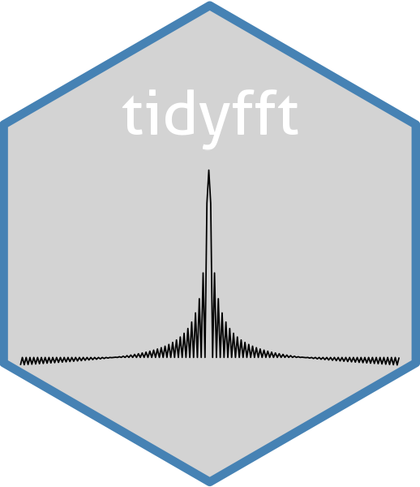
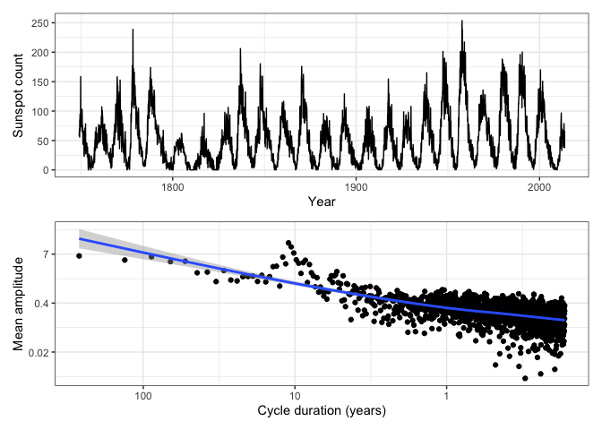

<!-- README.md is generated from README.Rmd. Please edit that file -->

# fftab <a href="https://github.com/thk686/fftab"></a>

<!-- badges: start -->

[](https://github.com/thk686/fftab/actions/workflows/R-CMD-check.yaml)
[](https://CRAN.R-project.org/package=fftab)
<!-- badges: end -->

The goal of **fftab** is to make working with fft’s in R easier and more
consistent. It follows [the tidy philosophy](https://www.tidyverse.org/)
by working with tabular data rather than lists, vectors, and so on.

### Installation

You can install the development version of fftab from
[GitHub](https://github.com/) with:

``` r
# install.packages("pak")
pak::pak("thk686/fftab")
```

### Example

Using fftab with ggplot.

``` r
fftab(sunspot.month, norm = TRUE) |>
  to_rect(.keep = "all") |>
  to_polr(.keep = "all") |>
  print(n = 5) ->
ssm.fft
#> # A tibble: 3,177 × 6
#>    .dim_1 fx              re     im   mod    arg
#>     <dbl> <cpl>        <dbl>  <dbl> <dbl>  <dbl>
#> 1 0       51.96+0.00i 52.0    0     52.0   0    
#> 2 0.00378  4.37+4.99i  4.37   4.99   6.63  0.852
#> 3 0.00755 -0.86+5.08i -0.860  5.08   5.15  1.74 
#> 4 0.0113  -2.65-5.70i -2.65  -5.70   6.29 -2.01 
#> 5 0.0151  -4.64-0.59i -4.64  -0.586  4.68 -3.02 
#> # ℹ 3,172 more rows
```

``` r
ggplot(fortify(sunspot.month)) +
  geom_line(aes(x = Index, y = Data)) +
  ylab("Sunspot count") +
  xlab("Year") +
  theme_bw() ->
p1

xlocs <- c(1, 0.1, 0.01)
xlabs <- c("1", "10", "100")

ssm.fft |>
  dplyr::filter(.dim_1 > 0) |>
  ggplot() +
  geom_point(aes(x = .dim_1, y = mod)) +
  geom_smooth(aes(x = .dim_1, y = mod)) +
  scale_y_continuous(trans = "log", labels = function(y) signif(y, 1)) +
  scale_x_continuous(trans = "log", breaks = xlocs, labels = xlabs) +
  xlab("Cycle duration (years)") +
  ylab("Mean amplitude") +
  theme_bw() ->
p2

print(p1 / p2)
```


