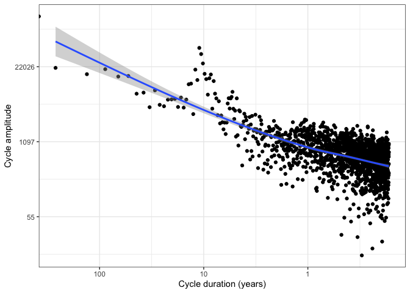

<!-- README.md is generated from README.Rmd. Please edit that file -->

# tidyfft

<!-- badges: start -->
<!-- badges: end -->

The goal of tidyfft is to make working with fft’s in R easier and more
consistent. It follows the tidy philosophy by storing output in a
tibble.

## Installation

You can install the development version of tidyfft from
[GitHub](https://github.com/) with:

``` r
# install.packages("pak")
pak::pak("thk686/tidyfft")
```

## Example

This is a basic example which shows you how to solve a common problem:

``` r
library(ggplot2)
library(tidyfft)
xlocs <- c(1, 0.1, 0.01)
xlabs <- c("1", "10", "100")
tidy_fft(sunspot.month) |>
  ggplot() +
  aes(x = frequency, y = mod) +
  geom_point() +
  scale_y_continuous(trans = "log", labels = function(y) round(y)) +
  scale_x_continuous(trans = "log", breaks = xlocs, labels = xlabs) +
  xlab("Cycle duration (years)") +
  ylab("Cycle amplitude") +
  geom_smooth() +
  theme_bw()
#> `geom_smooth()` using method = 'gam' and formula = 'y ~ s(x, bs = "cs")'
```


